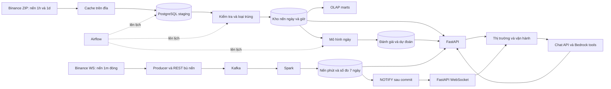

# Luồng dữ liệu CoinSight

Dữ liệu lịch sử và dữ liệu trực tiếp đều đến từ Binance Spot, nhưng phục vụ hai
mục đích và được lưu vào các bảng riêng. Sơ đồ dưới đây mô tả code hiện có.

## 1. Toàn hệ thống

Batch lấy lịch sử cho phân tích và mô hình; live lấy nến phút vừa đóng để theo dõi
thị trường. Model hiện tại chưa dùng live làm đầu vào. Chat gọi công cụ đọc kết quả
đã có, không điều khiển pipeline hay tự huấn luyện.

## 2. Lịch sử: tải, kiểm tra, nạp kho

1. [ingest_binance_history.py](../pipeline/batch/ingest_binance_history.py) chọn archive.
   [downloader](../pipeline/batch/binance_archive_downloader.py) tải ZIP và kiểm SHA-256;
   file được cache trên đĩa tại `data/raw/binance/`.
2. [format](../pipeline/batch/binance_archive_format.py) giải nén/ép kiểu.
   [staging_writer.py](../pipeline/batch/staging_writer.py) COPY vào PostgreSQL staging.
   Staging là bảng thật trên đĩa, không chỉ dữ liệu giữ trong RAM.
3. [quality_checks.py](../pipeline/batch/quality_checks.py) kiểm dữ liệu;
   [warehouse_loader.py](../pipeline/batch/warehouse_loader.py) loại dòng lỗi, giữ bản
   trùng mới nhất, upsert fact và làm mới mart.
4. Bảng `meta.*` giữ kết quả kiểm tra và đường truy từ lần load về archive nguồn.

Đóng gói `daily/monthly` khác độ dài nến `1h/1d`: một ZIP daily chứa nến 1h của
một ngày thường có 24 dòng. Các loại bảng, khóa và rule được định nghĩa ở
[Thiết kế kho dữ liệu](dw_design.md); định dạng đầu vào ở
[Giao ước dữ liệu](data_contracts_v1.md).

## 3. Trực tiếp: Kafka, Spark, PostgreSQL

[binance_live_client.py](../pipeline/stream/binance_live_client.py) chỉ phát nến phút
đã đóng; dùng REST bù nến bị lỡ sau reconnect.
[kafka_publisher.py](../pipeline/stream/kafka_publisher.py) gửi event vào Kafka.
[spark_stream_processor.py](../pipeline/stream/spark_stream_processor.py) đọc liên tục
và xử lý từng nhóm nhỏ event, gọi
[stream_sink_writer.py](../pipeline/stream/stream_sink_writer.py) ghi hai output:

- `dw.fact_candle_minute_live`: nến từng phút, có Kafka offset và kênh nguồn.
  Trùng `(pair, open_time)` thì bỏ qua; không ghi đè nến cũ.
- `dw.fact_stream_metric_v1`: số đo cửa sổ 7 ngày trượt mỗi ngày, gồm trung bình/std
  giá đóng, tổng volume, số event và thời điểm cuối. Aggregate được upsert.

Hai query ghi riêng, không có transaction chung. Nhánh metric có watermark một
ngày và dedup `event_id`; nhánh nến dựa vào khóa DB. Không giả định hai nhánh xử lý
sự kiện đến muộn giống nhau. Bảy ngày là độ dài cửa sổ, chưa chứng minh đủ dữ liệu.

## 4. Từ database tới giao diện

Sau commit, [trigger](../postgres/migrations/003_live_notifications.sql) phát
`NOTIFY coinsight_live` với symbol. [live_stream.py](../app/live_stream.py) LISTEN,
đọc lại DB rồi gửi snapshot tới browser.
[useLiveStream.js](../frontend/src/useLiveStream.js) cập nhật giao diện và reconnect.

Có hai WebSocket: Binance → producer và API → browser. Browser không nối thẳng
Binance. Summary 15 phút do **API tính từ nến phút**, khác metric 7 ngày do Spark tính.
Heartbeat không chứa giá mới; đồng hồ frontend đánh dấu dữ liệu cũ khi feed im lặng.

Bảng theo dõi Market dùng lịch sử ngày cho danh sách/chart và nến phút cho giá mới.
Signal là prediction ngày đã lưu. Operations chứa quality, lineage và chẩn đoán.
Hai workspace chưa có phân quyền người dùng/quản trị.

## 5. Mô hình và điều phối

Model ngày đọc warehouse → tạo đặc trưng → huấn luyện/đánh giá → lưu model hợp lệ
→ suy luận → API đọc prediction đã lưu. Target/điều kiện công bố chỉ định nghĩa ở
[giao ước ngày](dss_contract_v1.md). Model giờ mới có [giao ước](hourly_forecast_contract.md),
chưa có dataset/training và đường cấp nến giờ mới cho suy luận.

Airflow lên lịch **job**; Spark xử lý **stream** liên tục. Micro-batch của Spark
không do Airflow khởi động. Lịch hiện tại theo UTC:

| DAG | Lịch / nhiệm vụ |
| --- | --- |
| `coinsight_warehouse_daily` | 06:00: extract ngày trước → quality/load → báo cáo |
| `coinsight_direction_daily` | 07:30: thử train thứ Hai, predict mỗi ngày |

Hai DAG chưa có dependency buộc kho nạp xong trước khi DSS chạy. Lịch chạy không
chứng minh dữ liệu đã sẵn sàng. Cần bật profile Airflow và unpause DAG.

## 6. Nguồn dữ liệu và truy vết

Lineage nối dữ liệu tới file/batch/model; quality kiểm tra tính hợp lệ, độ mới và
độ phủ; Jaeger theo dõi thời gian xử lý và lỗi. Ba loại thông tin có vai trò khác nhau.
Live candle có Kafka offset; chưa có mapping đầy đủ mọi nến tới từng aggregate.

Tự xem trong DataGrip và chạy lệnh tại [Chạy hệ thống](running_system.md).
Phạm vi Jaeger ở [Theo dõi](observability.md); nghiệm thu ở [Tiến độ](product_readiness.md).
