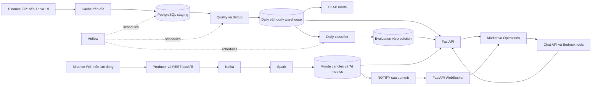

# Luồng dữ liệu CoinSight

Đối chiếu code ngày 09/10/2026. Trang này giải thích **dữ liệu từ đâu, biến đổi
thế nào, lưu ở đâu và ai sử dụng**. “Đã có code” không có nghĩa mọi service đang
chạy hoặc đã đủ tin cậy để production.

## 1. Bức tranh chung

CoinSight có hai đường lấy dữ liệu Binance Spot. **Batch lấy lịch sử** cho chart,
phân tích và model. **Live lấy nến phút vừa đóng** để quan sát thị trường hiện tại.
Hai đường cùng ghi PostgreSQL nhưng vào **các bảng khác nhau**.

```text
BATCH — lịch sử
Binance ZIP → cache trên đĩa → staging → kiểm chất lượng → warehouse → marts
                                                            │
                                      ┌─────────────────────┤
                                      ▼                     ▼
                               Daily model hiện có     API lịch sử
                                      │                     │
                                      └───────→ API ────────→ UI

LIVE — quan sát mới nhất
Binance WS → producer → Kafka → Spark → nến phút + metric trong PostgreSQL
                                               │
                                         commit + NOTIFY
                                               ▼
                                        API WebSocket → UI

CHAT
Người dùng → API → Bedrock chọn tool → đọc dữ liệu/kết quả đã lưu → trả lời
```

**Live chưa đi vào model hiện tại.** Chat không tự train model. Airflow điều phối
job batch/model, không đứng giữa Kafka và Spark.



## 2. Batch: từ ZIP tới warehouse

| Bước | Làm gì | Code / nơi lưu |
| --- | --- | --- |
| Download | Chọn coin/interval/giai đoạn, tải ZIP và kiểm SHA-256 | [ingest_binance_history.py](../pipeline/batch/ingest_binance_history.py), [binance_archive_downloader.py](../pipeline/batch/binance_archive_downloader.py); cache `data/raw/binance/` |
| Parse và stage | Giải nén CSV, chuẩn hóa timestamp/số, COPY vào PostgreSQL | [binance_archive_format.py](../pipeline/batch/binance_archive_format.py), [staging_writer.py](../pipeline/batch/staging_writer.py); `staging.stg_ohlcv` |
| Quality | Kiểm giá dương, OHLC hợp lệ, volume, thời gian, nguồn; ghi cảnh báo gap/trùng | [quality_checks.py](../pipeline/batch/quality_checks.py); `meta.dq_result` |
| Load | Giữ bản ghi staging mới nhất theo khóa, upsert fact, refresh marts | [warehouse_loader.py](../pipeline/batch/warehouse_loader.py); `dw.fact_ohlcv_daily`, `dw.fact_ohlcv_hourly`, `mart.*` |
| Audit | Ghi trạng thái job, file nguồn, checksum và batch liên quan | `meta.etl_batch`, `meta.source_file_manifest`, `meta.batch_dependency`, `meta.loaded_archive` |

**Staging là bảng trên đĩa trong PostgreSQL**, không phải chỉ giữ trong RAM.
Python dùng buffer tạm khi COPY. Fact là số đo như OHLC/volume; dimension là
thông tin tham chiếu như coin, ngày, giờ và nguồn.

Ví dụ archive `daily/klines/BTCUSDT/1h/BTCUSDT-1h-2026-10-04.zip` đóng gói
nến **một giờ** của **một ngày** — thường 24 dòng nếu đầy đủ. `daily/monthly`
là cách đóng gói file; `1h/1d` là độ dài mỗi nến. Không phải file daily chỉ có nến ngày.

Row lỗi không vào warehouse. Nếu tỷ lệ lỗi vượt ngưỡng cấu hình (hiện 5%), batch
load thất bại; kết quả quality vẫn được lưu. Warning không nhất thiết chặn load.
Fact cũ không bị nhân đôi khi chạy lại theo cùng khóa; dữ liệu thay đổi có thể
được cập nhật. Job vẫn có thể tạo audit record mới.

Task daily nạp thành công sẽ dọn staging của extract batch đó. Lệnh `make batch`
không truyền batch scope nên không tự dọn staging theo cơ chế này.

Flow là **Extract → Load staging → Transform → Load warehouse**. Transform ở
đây là chuẩn hóa, validation, dedup, ánh xạ dimension và tổng hợp mart; chưa phải
feature engineering hay train model.

## 3. Live: từ nến đóng tới browser

1. [binance_live_client.py](../pipeline/stream/binance_live_client.py) nhận Binance
   WebSocket. Chỉ phát nến khi nguồn đánh dấu đã đóng; REST dùng để bù nến bị lỡ.
2. [kafka_publisher.py](../pipeline/stream/kafka_publisher.py) gửi event chuẩn hóa
   tới topic live. Kafka giữ log event; nó không train model hay tính indicator.
3. [spark_stream_processor.py](../pipeline/stream/spark_stream_processor.py) đọc
   Kafka liên tục và xử lý thành micro-batch, tức từng nhóm nhỏ event.
4. [stream_sink_writer.py](../pipeline/stream/stream_sink_writer.py) ghi PostgreSQL.
   Hai output riêng:

| Output | Nội dung / cách ghi |
| --- | --- |
| `dw.fact_candle_minute_live` | Một nến cho `(pair, open_time)`; lưu OHLC, base/quote volume, transport và Kafka topic/partition/offset. Trùng khóa thì bỏ qua, không ghi đè nến cũ. |
| `dw.fact_stream_metric_v1` | Trung bình/std giá đóng, tổng volume, số event, thời điểm quan sát cuối; cửa sổ 7 ngày, trượt mỗi ngày. Aggregate được upsert. Có ghi thêm bảng metric tương thích cũ. |

Metric branch có watermark một ngày và dedup `event_id`; raw candle branch dựa
vào khóa database để chống ghi trùng. Không nên hiểu hai nhánh có cùng chính sách
xử lý late event. Nến và metric được ghi bởi hai streaming query, **không phải một
transaction chung**.

5. [DB triggers](../postgres/migrations/003_live_notifications.sql) phát
   `NOTIFY coinsight_live` sau commit, payload là symbol — không phải toàn bộ nến.
6. [live_stream.py](../app/live_stream.py) LISTEN, đọc lại summary/metric từ DB,
   gửi `live.snapshot` qua `/v1/assets/{symbol}/stream`.
7. [useLiveStream.js](../frontend/src/useLiveStream.js) nhận snapshot và cập nhật UI.
   Kết nối mới đọc snapshot ngay; đứt kết nối thì reconnect. Heartbeat không có
   nghĩa dữ liệu mới; frontend có đồng hồ riêng để đánh dấu dữ liệu cũ.

**Có hai WebSocket:** Binance → producer, và API → browser. Browser không nối
thẳng Binance. Live summary 15 phút được **API tính từ bảng nến phút**, khác với
metric 7 ngày do Spark tính. Cửa sổ “7 ngày” cũng chưa chứng minh đủ bảy ngày dữ liệu.

## 4. Model: dữ liệu đi vào đâu?

### Daily classifier — đã có implementation

```text
DW daily + hourly
    → feature_builder.py: return, range, volume change, hourly range
    → direction_model.py: train logistic regression + đánh giá baseline
    ├─ rejected → lưu evaluation, không công bố model mới
    └─ accepted → artifact + đăng ký model
                      ↓
          predict bằng feature ngày mới nhất hợp lệ
                      ↓
             dw.fact_direction_prediction → API /prediction → UI Signal
```

Train đọc lịch sử và label đã biết; predict đọc input mới cùng artifact đã train.
API đọc prediction đã lưu, không train mỗi lần mở trang. Artifact nằm ở đường dẫn
`DSS_MODEL_PATH` (lệnh Make local dùng `data/models/direction.joblib`), không trong Kafka.
Một candidate mới bị rejected không tự xoá model cũ đã được chấp nhận.

### Hourly XGBoost — contract đã có, implementation chưa có

```text
Backfill BTC hourly → frozen dataset → baseline + XGBoost → evaluation/artifact
                                                             │
Nến giờ mới đóng → quality/freshness gate → model đã promote ──┘
                                         ↓
                              forecast giờ → API/UI [chưa có]
```

Target là return/giá đóng giờ kế tiếp, không phải xác suất tăng. Mỗi sample có
168 feature rows, cần 169 nến raw để tính return; train cần thêm nến target.
ZIP lịch sử phục vụ train. Đường lấy nến giờ mới qua REST cho inference **chưa
được xây**, và bảng live phút không tự trở thành input hourly model.

Xem [contract giờ](hourly_forecast_contract.md). Đề xuất thử lịch sử từ 2024 thay
vì 2020 là điều chỉnh phạm vi đang bàn; chưa đổi split/config trong code hay tài
liệu contract. Không suy ra hệ thống đã backfill hoặc train XGBoost từ sơ đồ này.

## 5. Airflow, API, UI và chat làm gì?

| Thành phần | Trách nhiệm hiện tại |
| --- | --- |
| [Warehouse DAG](../airflow/dags/coinsight_warehouse.py) | 06:00 UTC: extract ngày trước → quality/load → quality report. |
| [DSS DAG](../airflow/dags/coinsight_dss.py) | 07:30 UTC: thử train thứ Hai, predict mỗi ngày. Hai DAG hiện dựa vào lịch, chưa có dependency buộc warehouse thành công trước DSS. |
| [FastAPI](../app/api.py) | Đọc warehouse, tính live summary, trả history/quality/lineage/prediction; đẩy live snapshot. |
| Market | Danh sách coin và chart là lịch sử daily; giá lớn là last close phút nếu có. Signal là daily prediction, chưa phải hourly forecast. |
| Operations | Xem quality, lineage, evaluation và stream diagnostics. Không phải trang có phân quyền admin. |
| [Bedrock chat](../app/chat_agent.py) | LLM chọn tool đọc snapshot/live summary/prediction/evaluation rồi diễn giải. Chưa có session memory; chat không điều khiển pipeline hay đặt lệnh. |

Airflow là **bộ điều phối**: đến lịch thì gọi code, theo dõi task và retry.
Spark là **bộ xử lý stream** chạy liên tục. Micro-batch của Spark không phải
batch job do Airflow khởi động. Airflow chỉ chạy khi bật profile và DAG.

## 6. Dữ liệu, lineage và trace khác nhau

- **Data:** giá, volume, nến, metric và prediction.
- **Lineage:** giá/prediction đó đến từ file/batch/model nào. Batch có đường
  `fact.batch_id → batch_dependency → source_file_manifest`. Live candle có Kafka
  offset; chưa có mapping đầy đủ từng nến tới từng aggregate.
- **Quality/evidence:** kiểm tra lỗi, freshness, coverage, baseline/evaluation
  giúp quyết định có nên tin kết quả. Có lineage không tự chứng minh model tốt.
- **Trace Jaeger:** job/tool nào chạy bao lâu và lỗi ở đâu. Không thay thế dữ liệu
  hoặc lineage lưu trong DB; Jaeger local hiện mất trace khi restart.

## 7. Tự lần theo một luồng

1. Mở Market tại `http://localhost:3000`, chọn BTC; phân biệt timestamp giá phút
   với ngày của chart. Đừng so hai số như thể chúng cùng thời điểm.
2. Trong DataGrip xem `dw.fact_candle_minute_live` để tìm nến phút đó, rồi xem
   Kafka offset/transport. Xem `dw.fact_ohlcv_daily` cho giá lịch sử.
3. Mở Operations hoặc `http://localhost:8000/docs`: thử `live-summary`,
   `data-status`, `lineage/batches/{batch_id}` và `model/evaluation`.
4. Xem Airflow `http://localhost:8081` khi bật profile để theo dõi task batch;
   xem Kafka UI `http://localhost:8080` cho event và Jaeger
   `http://localhost:16686` cho trace nếu các service đang chạy.

`docker compose up` chạy nhánh live và các service mặc định; **không tự backfill
toàn bộ lịch sử hay train model**. `make extract` / `make batch` chạy một lượt;
`make airflow` bật scheduler. `docker compose down` giữ named volumes;
`down --volumes` xoá chúng. File cache trên máy là nơi lưu khác với Docker volume.

Hướng dẫn lệnh và tiến độ: [README](../README.md). Chi tiết giao tiếp giữa các
bước: [data contracts](data_contracts_v1.md). Việc chưa xong và tiêu chí kiểm
chứng: [product readiness](product_readiness.md).
