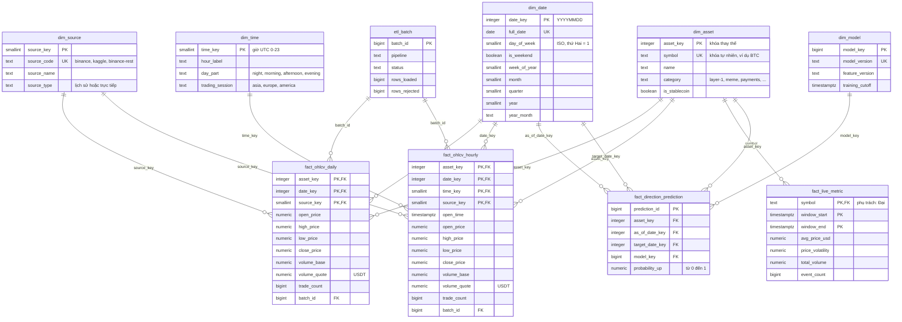

# Thiết kế kho dữ liệu: bảng, khóa và phép tổng hợp

Trang này giữ schema, quan hệ, phép tổng hợp và quy tắc chất lượng.
Luồng xử lý nằm tại [Luồng dữ liệu](data_flow.md); định dạng giao tiếp nằm tại
[Giao ước dữ liệu](data_contracts_v1.md). DDL thực tế trong `postgres/init/` và
`postgres/migrations/` là căn cứ khi sơ đồ cần cập nhật.

DDL đầy đủ nằm trong `postgres/init/`:

| File | Nội dung |
| --- | --- |
| `01_staging_meta.sql` | Schema `staging` (dữ liệu vừa tải) và `meta` (log ETL, kết quả DQ) |
| `02_dw_schema.sql` | Schema `dw` (dimension, fact) và `mart` (view phân tích) |
| `03_seed.sql` | Thông tin 20 coin trong `dim_asset` |
| `04_marts.sql` | Materialized view và view OLAP trong schema `mart` |

## 1. Các tầng dữ liệu

| Schema | Vai trò | Ai ghi | Ai đọc |
| --- | --- | --- | --- |
| `staging` | Nến OHLCV vừa tải, đã ép kiểu, chưa kiểm tra | `ingest_binance_history.py` | `warehouse_loader.py` |
| `dw` | Dimension và fact đã làm sạch | `warehouse_loader.py`, stream, DSS | Mart, API |
| `mart` | View tổng hợp cho phân tích và dashboard | Định nghĩa bằng SQL | API, dashboard, mô hình |
| `meta` | Log mỗi lần chạy ETL, kết quả từng rule DQ | Cả hai script ETL | Theo dõi, báo cáo |

Database đặt `search_path = dw, mart, meta, public`, nên mã nguồn dùng tên bảng
không kèm schema (như `dim_asset`, `fact_price`) vẫn chạy.

## 2. ERD

Mô hình là **galaxy schema** (fact constellation): nhiều bảng fact dùng chung
các **conformed dimension** `dim_asset` và `dim_date`.

Sơ đồ trên tập trung vào lịch sử, bảng metric tương thích cũ và mô hình ngày.
Trực tiếp hiện tại còn có `dw.fact_candle_minute_live` và `dw.fact_stream_metric_v1`
trong migrations; không coi sơ đồ này là toàn bộ schema. Hai bản vẽ khác của cùng schema
nằm trong `docs/diagrams/`, mỗi bản có `.png` (Word, GitHub), `.pdf` (LaTeX)
và `.drawio` (mở bằng <https://app.diagrams.net>):

| Sơ đồ | Nội dung |
| --- | --- |
| `dw_eerd` | EERD ký hiệu Chen: fact là thực thể yếu (khung đôi), liên kết định danh là hình thoi đôi, thuộc tính dẫn xuất nét đứt, khóa bộ phận gạch chân nét đứt |
| `dw_relational` | Ánh xạ sang lược đồ quan hệ: khóa chính gạch chân, mũi tên đi từ khóa ngoại đến khóa được tham chiếu |

Hai sơ đồ được sinh bằng `scripts/generate_diagrams.py`. Khi schema đổi, sửa
danh sách bảng trong script rồi chạy `python scripts/generate_diagrams.py`
(cần Inkscape); chỉnh tay file `.drawio` sẽ bị ghi đè ở lần chạy sau.

## 3. Độ hạt của các bảng fact

| Bảng fact | Một dòng là | Khóa | Phụ trách |
| --- | --- | --- | --- |
| `fact_ohlcv_daily` | 1 coin × 1 ngày UTC × 1 nguồn | `asset_key, date_key, source_key` | Nhi |
| `fact_ohlcv_hourly` | 1 coin × 1 giờ UTC × 1 nguồn | `asset_key, date_key, time_key, source_key` | Nhi |
| `fact_live_metric` | 1 coin × 1 cửa sổ trượt 7 ngày | `symbol, window_start, window_end` | Đại |
| `fact_direction_prediction` | 1 coin × 1 ngày as-of UTC × 1 ngày mục tiêu UTC × 1 mô hình | `asset_key, as_of_date_key, target_date_key, model_key` | Dương |

Bảng theo ngày và theo giờ được tách riêng vì mỗi bảng fact chỉ có một grain.
Cả hai đều nạp trực tiếp từ nến gốc của Binance, không suy ra bảng này từ bảng
kia. Rule DQ `daily_hourly_reconciliation` đối chiếu hai bảng với nhau.

## 4. Các số đo và cách tổng hợp

| Measure | Loại | Cách tổng hợp đúng |
| --- | --- | --- |
| `volume_base`, `volume_quote`, `trade_count` | Cộng được | `sum` theo mọi chiều |
| `open_price` | Không cộng trực tiếp | Giá của kỳ đầu tiên |
| `close_price` | Không cộng trực tiếp | Giá của kỳ cuối cùng |
| `high_price` / `low_price` | Không cộng trực tiếp | `max` / `min` |
| `daily_return` (trong mart) | Không cộng trực tiếp | Trung bình, độ lệch chuẩn, hoặc nhân dồn |

Giá và volume quote tính theo **USDT**. Không gọi đó là USD trong API/contract.

## 5. Kiểm tra chất lượng

Có 7 rule loại dòng lỗi và 5 kiểm tra cảnh báo. Ngưỡng hiện tại cho phép tối đa
5% dòng bị loại; vượt ngưỡng thì load bị huỷ. Xem mã nguồn
[quality_checks.py](../pipeline/batch/quality_checks.py) để đối chiếu predicate.

| Rule | Mức | Kiểm tra |
| --- | --- | --- |
| `not_null` | Loại dòng | Có đủ mã coin, giá và volume |
| `positive_price` | Loại dòng | Mọi giá > 0 |
| `ohlc_consistency` | Loại dòng | High là lớn nhất, low là nhỏ nhất |
| `non_negative_volume` | Loại dòng | Volume và số giao dịch không âm |
| `interval_alignment` | Loại dòng | Nến bắt đầu đúng mốc ngày hoặc giờ UTC |
| `known_source` | Loại dòng | Nguồn có trong `dim_source` |
| `date_in_calendar` | Loại dòng | Ngày nằm trong `dim_date` |
| `duplicate_grain` | Cảnh báo | Nến trùng grain |
| `zero_volume` | Cảnh báo | Nến không có giao dịch |
| `continuity_gaps` | Cảnh báo | Chỗ thiếu nến giữa hai nến |
| `freshness` | Cảnh báo | Coin có nến mới nhất cũ hơn 2 ngày |
| `daily_hourly_reconciliation` | Cảnh báo | Volume ngày lệch hơn 1% so với tổng volume giờ |

## 6. Kho phân tích OLAP

Định nghĩa trong `postgres/init/04_marts.sql`. Các materialized view được
`warehouse_loader.py` refresh trong cùng transaction với lần nạp fact, nên mart không
bao giờ hiển thị dữ liệu nạp dở.

| Mart | Loại | Cách tổng hợp | Trả lời câu hỏi |
| --- | --- | --- | --- |
| `mart.v_daily_return` | view | Window `lag` theo coin và nguồn | Return và biên độ từng ngày; nền cho các mart khác |
| `mart.mv_asset_period_summary` | materialized view | `ROLLUP(year, quarter, month)` | Hiệu suất coin theo tháng → quý → năm → toàn kỳ (roll-up, drill-down) |
| `mart.mv_category_performance` | materialized view | `CUBE(category, year, quarter)` | Nhóm coin nào rủi ro, sinh lời nhất theo từng tổ hợp thời gian (slice, dice) |
| `mart.mv_hourly_activity` | materialized view | `GROUPING SETS` theo coin, phiên, giờ | Phiên giao dịch nào sôi động và biến động nhất |
| `mart.v_top_movers` | view | `rank()` trên mart theo quý | 3 coin tăng và giảm mạnh nhất mỗi quý |
| `mart.fact_price` | view | — | Giữ tương thích với API hiện tại |

Dòng tổng được đánh dấu bằng cột `period_level`, `grouping_id` hoặc nhãn
`ALL` thay vì để `NULL`, nên client lọc được mà không cần gọi `GROUPING()`.

Truy vấn mẫu cho các thao tác OLAP nằm trong `postgres/queries/olap_examples.sql`;
lệnh chạy được hướng dẫn tại [Chạy hệ thống](running_system.md).

## 7. Quyết định thiết kế

- **Galaxy schema thay vì snowflake**: dimension nhỏ (tối đa vài nghìn dòng)
  Nên không cần chuẩn hóa thêm; join ít hơn giúp truy vấn OLAP đơn giản.
- **Surrogate key** cho `dim_asset` và `dim_source`: fact không phụ thuộc vào
  Cách nguồn đặt mã, và join trên số nguyên nhanh hơn trên text.
- **`date_key` dạng YYYYMMDD**: vẫn là số nguyên nhưng đọc được bằng mắt.
- **SCD Type 1** cho `dim_asset`: thay đổi tên hoặc nhóm coin ghi đè dòng cũ.
  Thuộc tính coin hiếm khi đổi và chưa có câu hỏi nghiệp vụ cần lịch sử của nó.
- **`dim_source`** giúp schema không phụ thuộc nguồn: thêm Kaggle chỉ cần thêm
  Dòng với `source_code = 'kaggle'`.
- **Tất cả thời gian theo UTC**, vì cả Binance lẫn stream đều dùng UTC.
- **Ràng buộc CHECK trong bảng fact** lặp lại các rule DQ quan trọng, làm lớp
  Bảo vệ cuối nếu có dữ liệu ghi thẳng vào `dw` mà không qua ETL.
